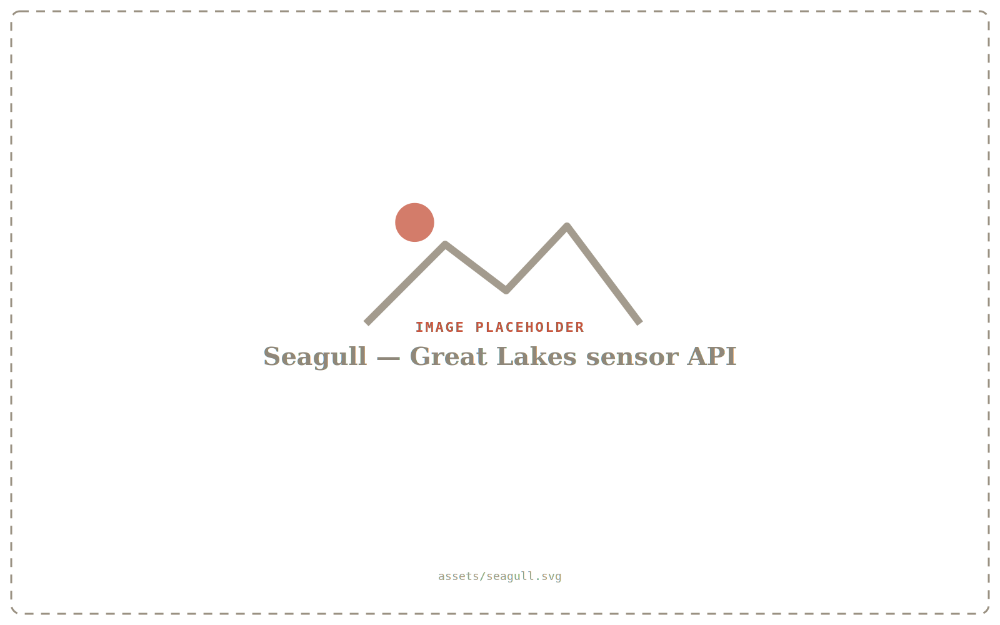

# Slides — *Using Python to explore our world*

A zero-build, web-based slide deck (reveal.js) with a **bitmap-font** look.

**Image-first:** slides are mostly images while you talk; the actual script lives
in **speaker notes** (press **S**). Keep on-slide text minimal and non-verbatim.
Every image has a generated placeholder, so the deck looks finished before the
real screenshots exist.

```
docs/slides/
  index.html          ← loads reveal.js + Google bitmap fonts from a CDN
  theme.css           ← the look (edit the variables at the top)
  slides.en.md        ← the deck (English). Copy → slides.es.md for Spanish.
  assets/             ← images + manifest.json
    fonts/            ← drop MondWest / NeueBit / Departure Mono here (see its README)
  tools/
    make_placeholders.py   ← regenerates the SVG placeholders
  serve.sh            ← one-line local server
```

## Run it

External Markdown can't be loaded from `file://`, so serve over HTTP:

```bash
cd docs/slides
./serve.sh              # or: python3 -m http.server 8000
```

Then open <http://localhost:8000/>. For Spanish (once `slides.es.md` exists):
<http://localhost:8000/?lang=es>.

## Present

- **Arrows / Space** — navigate.  **F** — fullscreen.  **Esc / O** — slide overview.
- **S** — speaker view: current + next slide, **the full narration**, and a timer.
  (The draft script lives in the `Note:` blocks, so the slides stay clean.)

## Export to PDF

Open with `?print-pdf` and print to PDF from the browser:

<http://localhost:8000/?print-pdf> → Cmd/Ctrl-P → *Save as PDF* (Background graphics on,
margins none). e.g. `…/?print-pdf&lang=es`.

## Edit the slides

`slides.en.md` is plain Markdown with two conventions:

- A line containing only `---` (blank line above and below) **starts a new slide**.
- Everything after a line starting with `Note:` becomes **speaker notes**.

A typical image-first slide is just a figure + a one-word kicker, with the talk
in the note:

```markdown
<figure>
  
  <figcaption>acquire</figcaption>
</figure>

Note:
First task: get the data...
```

Per-slide options use an HTML comment as the slide's first line:

```markdown
<!-- .slide: class="bleed" data-background-image="assets/lake-summer.svg" data-background-size="cover" -->
```

Handy slide classes (in `theme.css`): `divider` (dark section break),
`quote` (big refrain), `bleed` (full-bleed photo; add a `.lower-third` for a
corner kicker). Helpers: `.phones` (centered phone pair), `.eyebrow` / `.center`
(kickers), `.byline`, `.tag`, `.cols`/`.shots` (text+media layouts, still available).

## Fonts

The deck loads free bitmap fonts from Google Fonts (**Pixelify Sans** +
**DotGothic16**). To use the nicer ones, drop the files into
[`assets/fonts/`](assets/fonts/) — **MondWest** / **NeueBit** (Pangram Pangram)
and **Departure Mono** (free) take over automatically. See
[`assets/fonts/README.md`](assets/fonts/README.md). To re-skin, edit the
`--display` / `--sans` / `--mono` and color variables at the top of `theme.css`.

## Images

Every image is listed in [`assets/manifest.json`](assets/manifest.json). Running
the generator writes a labeled SVG placeholder per entry:

```bash
python3 tools/make_placeholders.py            # only missing ones
python3 tools/make_placeholders.py --force    # rewrite all
```

**To use a real image:** drop it in `assets/` (e.g. `seagull.png`) and update the
path in `slides.en.md` — or simply overwrite the `.svg`. To add a new image,
add an entry to `manifest.json`, rerun the generator, and reference it in a slide.

## Translate

1. `cp slides.en.md slides.es.md`
2. Translate the text (keep the `<!-- .slide: ... -->` comments and `---`/`Note:` lines).
3. Open <http://localhost:8000/?lang=es>.

Nothing else changes — `index.html` loads `slides.<lang>.md` based on the URL.
