<!-- Using Python (and more) to explore our world — English source. Conventions: see README.md.
     IMAGE-FIRST: slides are images + a tiny kicker. The talk lives in the Note: blocks
     (press S for the speaker view). Keep on-slide text minimal and non-verbatim. -->
<!-- .slide: class="divider title-slide" data-background-color="var(--dark)" -->

# Using Python (and more) to explore our world

David Eads &nbsp;·&nbsp; davideads@gmail.com recoveredfactory.net

Note:
I'm a data journalist — which basically means I'm a full-stack engineer whose end product is news or investigations. Today, you get to be one too.

It's cool because you get to use science, logic and technology to hopefully make the world a little more fair and humane place. And also just to be curious, to step back and see the world in different ways and talk to interesting people. It hasn't made me rich, but I've seen the world and been able watch history as it happens.

---

<!-- .slide: class="bleed" data-background-image="assets/mexico-graves-map.png" data-background-size="cover" data-background-color="var(--dark)" -->

Note:
A lot of the stuff I've done — and still do — is about heavy subjects. Human rights, discrimination, the disappeared. This is a map of clandestine mass graves in Mexico. We'll come back to this particular project at the end of my talk once we've talked about the process. 

But I also do this for fun and pleasure and my own curiosity and sense of beauty. We'll start with some examples like that, stuff you could imagine doing to make your life a little better or easier.

---

<!-- .slide: class="divider steps" data-background-color="var(--dark)" -->

The process

(<b>Step 0</b>: Ask a good question.)

<ol class="steps-list">
<li>Data acquisition</li>
<li>Processing</li>
<li>Analysis and visualization</li>
<li>Reporting</li>
<li>Publishing</li>
</ol>

Note:
Every project starts with a two part question: The first part is something like: Do parking tickets send people into bankruptcy? What neighborhoods have the most garbage dumpsters? 

The second part is: Did somebody measure that?

If the answer is yes, you then need to get the data, clean it into something you can work with, find what it means and show it, write it up, and put it out in the world.

---

<!-- .slide: class="bleed" data-background-image="assets/lake-summer.jpg" data-background-size="cover" data-background-color="var(--dark)" -->

<h2 class="overlay-q">Is the water warm enough to swim?</h2>

Note:
Let's start with a joyful project. The question was this: Is it warm enough to go swimming?

 I used to live in Chicago, on a huge lake — basically a sea. I loved to go for a run and then jump in the water when I lived near one of the beaches.

---

<!-- .slide: class="bleed" data-background-image="assets/lake-frozen.jpg" data-background-size="cover" data-background-color="var(--dark)" -->

"Frozen Staircase to Lake Michigan" — <a href="https://flickr.com/photos/shutterrunner/32404337645/">Shutter Runner / Flickr</a> · CC BY-NC 2.0

Note:
The problem: Chicago is cold most of the year. This isn't my photo, but it's from same beach just looking the other direction. And in the middle of winter. So I wanted to know: When is the lake warm enough, for what *I* can tolerate, to go swimming? 

---

<!-- .slide: class="step" -->

<figure>
  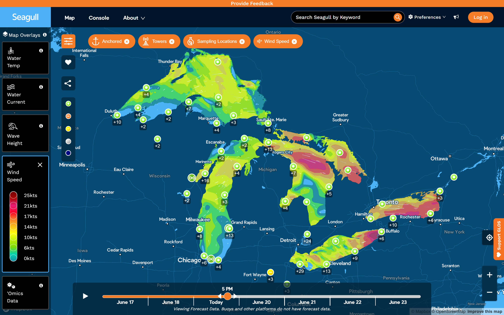
  <figcaption class="step">1. Acquire</figcaption>
</figure>

Note:
Again: I wonder if somebody measures that? In this case I figured there must be sensors in the lake measuring temperature and wind. A lot of environmental monitoring in the US is public, so I guessed maybe I had a chance of finding something. Miraculously, a few searches later, I found out that yes! A university had just published an API for every sensor in the entire Great Lakes region. It's called Seagull.

There's all sorts of data out there waiting to be liberated. How many kids get hurt on trampolines? A US agency tracks that. And especially in Mexico and Colombia there's *more* interesting public data than in the US right now — it's just locked up in old, peculiar systems.

---

<!-- .slide: class="step" -->
<!-- CODE SLIDES: use a BARE top-level <pre> (NOT wrapped in <figure>) so blank lines are
     allowed — marked treats <pre> as a type-1 HTML block (blank-line-safe); a <figure>
     wrapper is type-6 and ENDS at the first blank line, re-parsing the rest as Markdown
     (# → <h1>, URLs autolink). The "N. Verb" label is a standalone <figcaption>. -->

<pre><code class="language-python" data-trim data-line-numbers>import datetime as dt, requests, pandas as pd
etiquetas = {20: "Temperatura del agua", 21: "Viento"}
hoy = dt.date.today()

consulta = {
    "startDate": (hoy - dt.timedelta(days=7)).isoformat(),
    "endDate": hoy.isoformat(),
    "obsDatasetId": 98,
    "parameterId": ",".join(map(str, etiquetas)),
}
res = requests.get("https://seagull-api.glos.org/api/v1/obs",
                   params=consulta).json()

# aplanar el JSON anidado en una sola tabla ordenada
filas = [{**obs, "parametro": etiquetas[p["parameter_id"]]}
         for p in res[0]["parameters"] for obs in p["observations"]]
df = pd.DataFrame(filas)
df["fecha"] = pd.to_datetime(df["timestamp"])
</code></pre>

<figcaption class="step">2. Process</figcaption>

Note:
Processing. I built a query for a few recent days, pulled the JSON, and flattened its nested shape into one tidy table I could analyze. No database, no archive — keep it simple. (This started life as an Observable JavaScript notebook; here's the same idea in Python.)

---

<!-- .slide: class="step" -->

<pre><code class="language-python" data-trim data-line-numbers># solo la temperatura del agua, promedio diario
agua = (df[df.parametro == "Temperatura del agua"]
        .set_index("fecha")["value"].resample("D").mean())

# "escala sentida": clasificar la temperatura en bandas cualitativas
bordes = [-99, 12, 14, 16, 18, 22, 24, 99]
nombres = ["peligroso", "vigorizante", "terapéutico", "tolerable",
           "nadable", "🤩 perfecto", "muy cálido :/"]
sensacion = pd.cut(agua, bins=bordes, labels=nombres)

print("hoy el lago se siente:", sensacion.iloc[-1])
sensacion.value_counts()   # cuántos días en cada sensación
</code></pre>

<figcaption class="step">3. Analyze</figcaption>

Note:
Analysis is deciding what the numbers *mean*. I have no intuition for 14°C versus 20°C, so I looked up what scientists consider dangerous — that was my floor. Then, every time I swam, I logged the temperature and how it actually felt. Enough entries, and I could map that experience back onto the data — a "felt scale" that turns a number into a feeling. `pd.cut` does exactly that: it slices the continuous temperature into my named bands. 22°C feels perfect after a hard run. 

The numbers are a signal — but it's my experience combined with them that gives them meaning.

The lake now sometimes exceeds 24c, which feels great as well but is higher than any previously recorded temperature. Even in this fun project, a little reminder of climate change.

---

<!-- .slide: class="step" -->

<figure>
  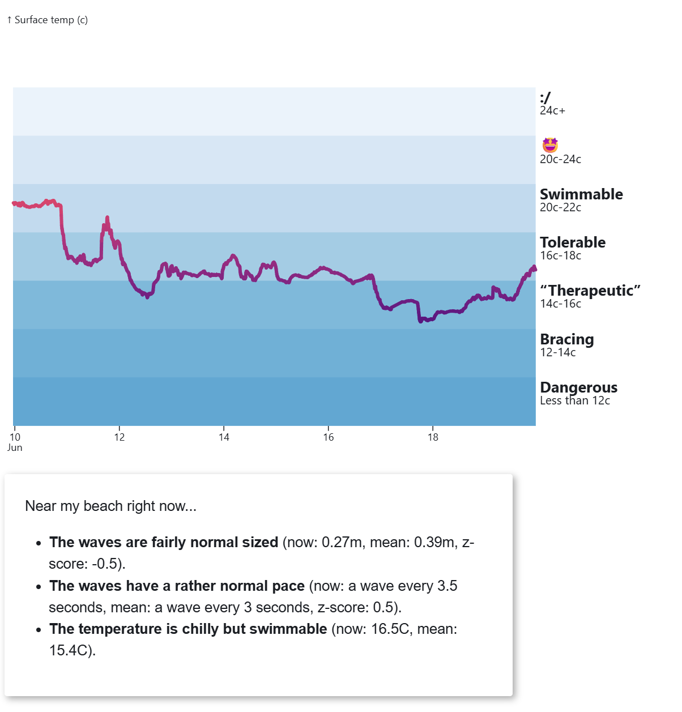
  <figcaption class="step">4. Visualize + publish</figcaption>
</figure>

Note:
You can't analyze without visualizing. This chart and these sentences map my opinions and experience of the lake conditions onto the data, and then present them in a way that deepens our understanding: The line chart shows us not only the current temperature, but the trend.

I didn't do a lot of reporting for this, though I did call and spoke with the people who make the API to make sure I was using the system correctly and using the right numbers. And i published my work in a public notebook.

---

  <figure>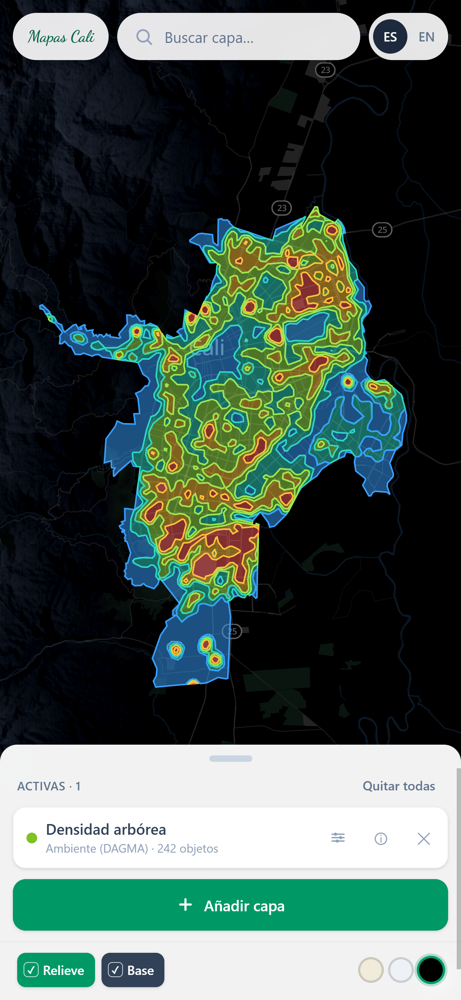</figure>
  <figure>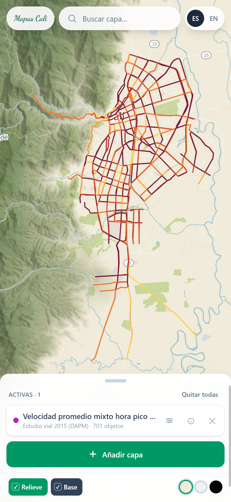</figure>

Note:
Now from Chicago to Cali. A few years ago I fell in love with someone here — and with the city: the culture, the mountains, the weather, the energy. So of course I wanted to see what data I could find about it. After digging, I found a map server that was hard to work with but full of fascinating data — the city actually publishes a lot. This was 2024, before AI got good at code: I wrote a primitive scraper, saw it was a gold mine — tree density, a digital elevation model, the city in 3D — and set it aside because it was a lot of work to decode the system. In this regard, AI has been amazing. Sraping a system like this used to be too much for most beginners. When I came back to it, I simply asked Claude to pull every dataset the city advertises and process it for web mapping — but I still needed the mental model: how the system fits together, and which tools to use.

---

The pillars

<ul class="stack">
  <li><b>Dagster</b> — Python-based; "orchestrates" data pipelines to process the data.</li>
  <li><b>Protomaps</b> — processes and converts the data for modern systems.</li>
  <li><b>SvelteKit w/ Maplibre</b> — Sveltekit offers a simple frontend (many such options), Maplibre is the current best open web mapping library.</li>
  <li><b>AWS + SST</b> — deployment.</li>
</ul>

Note:
These are the four pillars of the Cali build — the answer to "which tools to use." Dagster orchestrates the pipeline in Python: acquire, then process. Protomaps converts hundreds of layers into one modern, efficient tile format. MapLibre draws the map in the browser, with SvelteKit as a lightweight frontend around it. AWS, wired up with SST, puts it online. 

---

<!-- .slide: class="step" -->

<figure>
  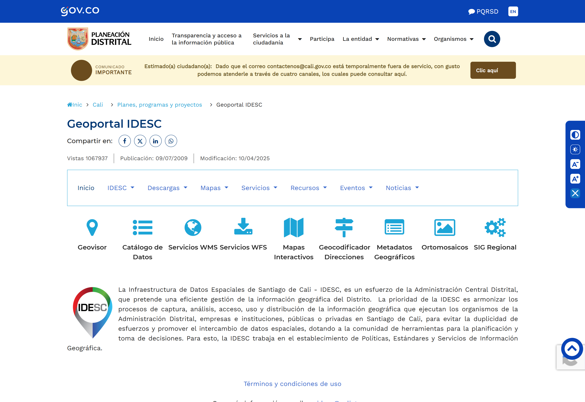
  <figcaption class="step">1. Acquire</figcaption>
</figure>

Note:
Step one, acquire. This is IDESC — Cali's open spatial-data catalog. Everything the city publishes lives here: WFS and WMS services, downloads, ortho imagery, a geocoder. Acquisition is just getting that raw material in the door — pulling each layer down so the rest of the pipeline has something to build on.

---

<!-- .slide: class="step" -->

<figure>
  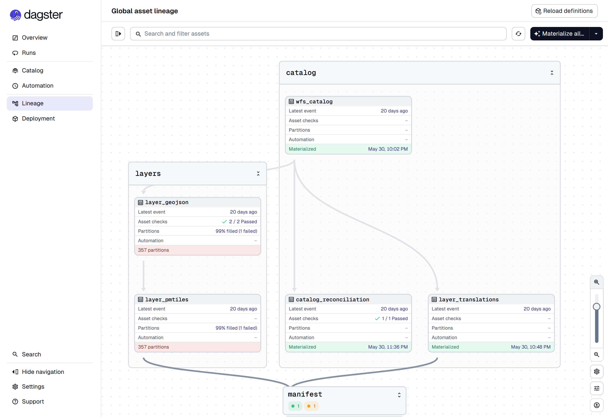
  <figcaption class="step">2. Process</figcaption>
</figure>

Note:
Why orchestrate a pipeline? At this scale — 350-plus layers, 6.6 GB of input — you need to rebuild your output from scratch or partially, test it for accuracy, and add new sources without breaking everything. That's what an orchestrator gives you.

---

Dagster · assets &amp; dependencies

<pre><code class="language-python" data-trim data-line-numbers>import dagster as dg

@dg.asset
def raw_layers():
    data = scrape_idesc_catalog(to="data/raw")       # 1. acquire
    return data

@dg.asset(deps=[raw_layers])                  # ← depends on the step above
def map_tiles(data):
    build_pmtiles(data, "cali.pmtiles") # 2. process
</code></pre>

Note:
If you write Python, Dagster is a great choice. It's *data-first*: each step is an asset — a noun, the thing you want to exist — and you wire them with explicit dependencies, `deps=[...]`. 

Two alternatives worth knowing: Prefect turns existing Python into pipelines fast, with less structure — good when your work is verbs more than nouns ("notify me"). Airflow is mature but painful, mostly big enterprises and universities.

---

<figure>
  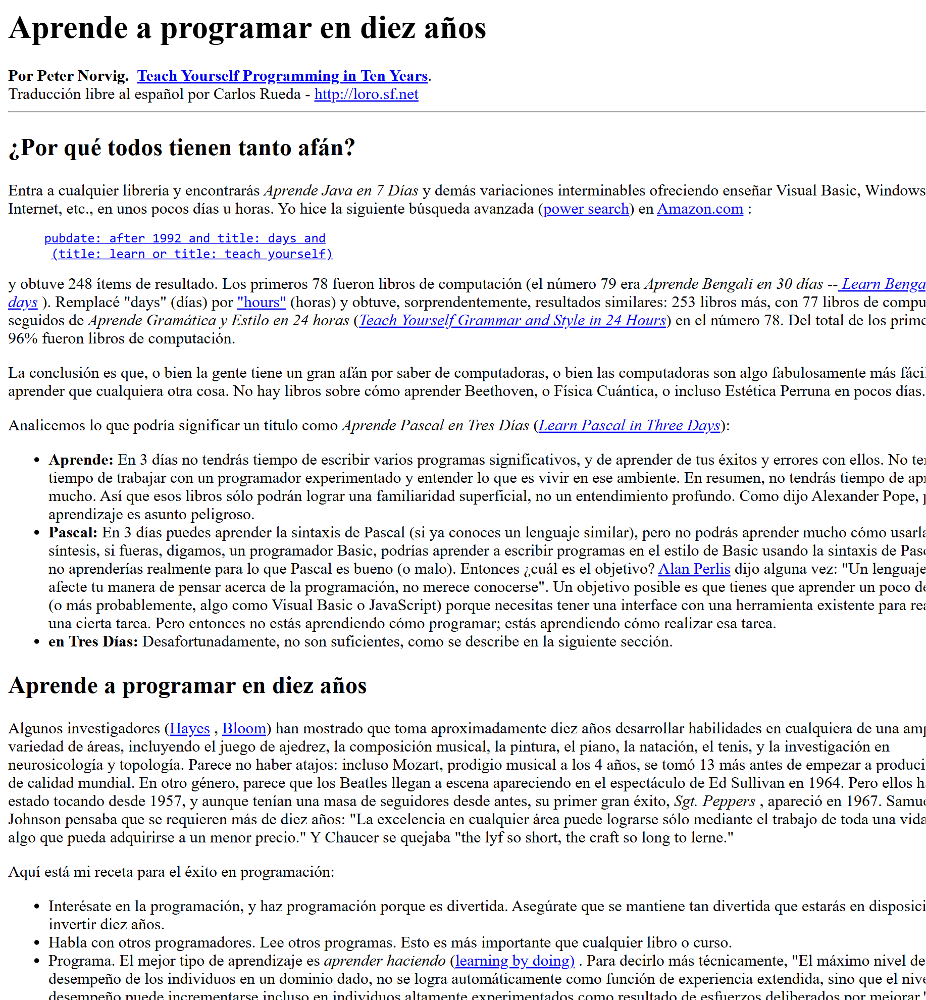
</figure>

Note:
A quick tangent. "Data-first versus flow-first" sounds abstract — that understanding only comes with time. Peter Norvig has a wise essay, "Teach Yourself Programming in Ten Years." It's like learning Spanish: we say "sueño contigo" — I dream *with* you — where English says "I dream *of* you." Same idea, different emphasis. Same with these tools.

---

<figure>
  
  <figcaption>354 layers of Cali</figcaption>
</figure>

Note:
The result: 354 map layers about Cali — trees, bike lanes, flood zones, so much. Some of it is old and probably inaccurate, but it's incredible. For the map engine I chose Protomaps plus MapLibre: nearly as powerful as Mapbox, free, and fast on cheap phones — which matters a lot in Colombia. AI wrote the code; I chose the tools. Next step is research and phone calls to learn what the data really means.

A map of clinics, or underdeveloped zones, is inherently a map about justice and politics — which brings us back to the heavy work.

---

<!-- .slide: class="bleed" data-background-image="assets/desaparecidos-map.png" data-background-size="cover" data-background-color="var(--dark)" -->

<h2 class="map-claim">Govt said: 230 mass graves. We counted: almost 2,000.</h2>

Note:
In 2017–2018 I was part of a team of Mexican journalists who won the Premio Gabo for our work on clandestine mass graves and the disappeared. I built a map that millions of people saw.

What made it good data journalism was curiosity aimed at accountability. The national government said about 230 graves had been found. But county and state authorities tracked graves too. We requested those records, added them up — and counted more than 2,000.

---

<!-- .slide: class="bleed" data-background-image="assets/fosas-2023.png" data-background-size="cover" data-background-color="var(--dark)" -->

<h2 class="map-claim">In 2023, the government finally admitted to more than 5,600 graves.</h2>

Note:
And the number never stopped climbing. By 2023 the government's own search body — the Comisión Nacional de Búsqueda — had admitted to more than 5,600 clandestine graves. The figure we were once doubted for is now dwarfed by the state's own count. That's the payoff of curiosity aimed at accountability: given time, it's vindicated.

---

  <figure>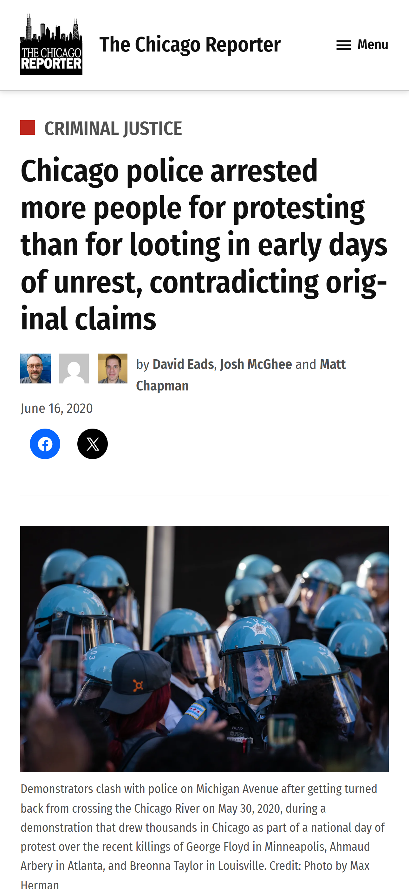</figure>
  

    <figure>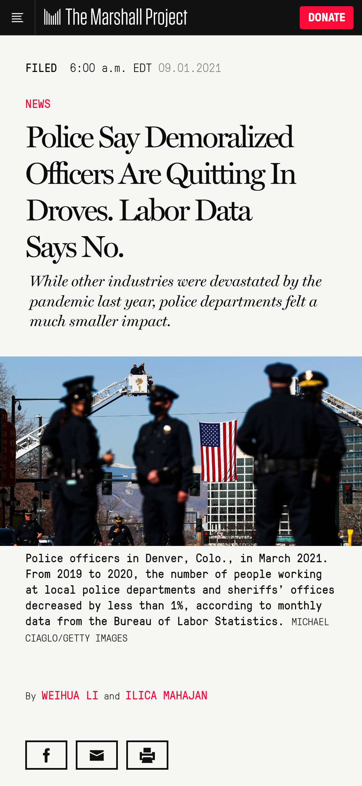</figure>
    <figure>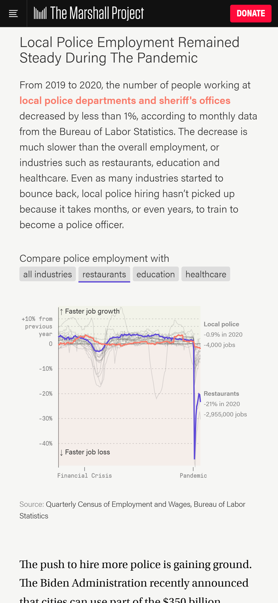</figure>
  

I can check that

Note:
The heart of it: someone in power says "police hiring is collapsing," or "most of the people we arrested were looting" — and you think, *I can check that.* In Chicago, police arrested more people for protesting than for looting. Nationally, officers said they were quitting in droves; the labor data said no.

---

<!-- .slide: class="quote" -->

"I wonder if someone is measuring that?"

Then go check. David Eads · davideads@gmail.com · recoveredfactory.net

Note:
That's the whole talk in one line: ask the question, then go check. Thank you.

Links: observablehq.com/@eads/waves-on-my-beach · data.adondevanlosdesaparecidos.org

---

<!-- .slide: class="divider" data-background-color="var(--dark)" -->

Activity

# Your turn

Pair up — it works best with one person looking things up and prompting, the other exploring the data and building.

Note:
Your turn. You'll point a Claude skill at Colombian open data and walk the same path as the whole talk — acquire, process, analyze. One tip before you start: pair up. This goes best when one of you is looking things up and steering the conversation while the other explores the data or builds — then trade off.

---

<!-- .slide: class="divider steps" data-background-color="var(--dark)" -->

Get set up

<ol class="steps-list">
<li>Install deps — Claude + Python libs</li>
<li>Install the skill</li>
<li>Get to chatting</li>
</ol>

Note:
Three steps and you're ready. One — install Claude (Code or desktop) and the Python data libraries: pandas and friends. Two — drop the `colombia-open-data` skill where Claude can find it. Three — just ask, in plain Spanish: "find me internet-access data by department." Claude uses the skill to search datos.gov.co, read a dataset's columns, and pull exactly the rows you want. Then you walk the same path as the rest of the talk: acquire, process, analyze.

---

Just ask — in Spanish

  
Búscame el acceso a internet fijo por departamento en Colombia, 2023.

  
Listo. Uso el skill colombia-open-data: busco el dataset en datos.gov.co, leo sus columnas y traigo las cifras…

Note:
You don't start by writing code — you just ask, in plain Spanish: "find me fixed-internet access by department, 2023." Claude recognizes the skill, searches datos.gov.co for the right dataset, reads its columns, and works out the query. You stay in the language of the question; the skill handles the plumbing.

---

<!-- .slide: class="step" -->
<!-- CODE SLIDE: bare top-level <pre> (see the note on the Seagull slide). -->

Under the hood

<pre><code class="language-bash" data-trim data-line-numbers># Claude corre el skill por ti:
python3 cli.py query n48w-gutb \
  --select "departamento,sum(no_de_accesos::number) as accesos" \
  --where "anno='2023' and trimestre='3'" \
  --group departamento --order "accesos desc" --limit 5

# Bogotá D.C.        2.251.960
# Antioquia          1.615.103
# Valle del Cauca      916.250
# Cundinamarca         649.508
# Atlántico            470.721
</code></pre>

<figcaption class="step">The skill in action</figcaption>

Note:
Here's what "the skill" actually does. You ask a question; Claude turns it into a query against datos.gov.co and runs it. Two lessons hide in this one screen. First: we aggregate on the server — `sum()` grouped by department — so we pull five rows, not 2.8 million. Second: we pin one quarter (2023-T3), because subscribers are a *stock*, not a flow — adding up every quarter would count the same people over and over. Real numbers, straight from the source: Bogotá leads with 2.25 million.

---

<!-- .slide: class="step" -->

<figure>
  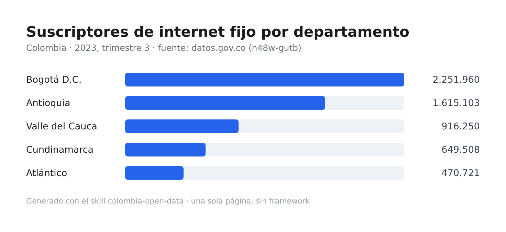
  <figcaption class="step">A page you can share</figcaption>
</figure>

Note:
Then ask Claude to turn those numbers into something you can see and share: a simple HTML page — a bar chart, a table, a little map. No framework, no build step, just one file you can open in a browser or send to a friend. That's "visualize and publish," scaled down.

---

Things to try next

<ul>
  <li>Chart or map something that surprises you.</li>
  <li>Research how a dataset is actually produced.</li>
  <li>Look for data that contradicts public rhetoric.</li>
  <li>Join two datasets — like the laws a politician wrote against the money they've taken.</li>
  <li>Add Dagster or Prefect to make it a reliable, repeatable pipeline.</li>
</ul>

Note:
Where to take it. Chart or map something interesting. Dig into how a dataset is produced — who made it, how, and what's missing. Look for places the data contradicts what people in power say. Join one dataset to another — the legislation a politician has written against the donations they've received is a classic. And when a one-off becomes something you want to trust and repeat, wrap it in Dagster or Prefect. And remember: pair up, and trade off.
